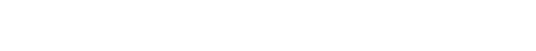

Problem link: https://codeforces.com/problemset/problem/1764/D

The most important observation: if there are $\geq \lfloor \frac{n}{2} \rfloor$ consecutive pegs that are removed, the blue peg will be touched

The general idea is to count the total number of ending states (Remove 1 peg to have the blue peg touched)! For each ending state, the total ways to reach the ending state are $n!$, such that $n$ is the total number of pegs that are removed.


when n is odd

We can fix a peg x,

```plaintext
 o o
o . o
  x
```

Generally, for when $n$ is odd number, you can kind of visualize it as having 3 groups, x as a group of itself, the left of x with floor(n/2) pegs, and the right of x with another floor(n/2) pegs

```plaintext
 /o/ \o\
/o/ . \o\
   |x|
```

For the next $\lfloor \frac{n}{2} \rfloor$ pegs to x (clockwise), we can select one of them. And let it be y

```plaintext
 y o
o . o
  x
```

the first peg after x can also be y

Only one peg from these $\lfloor \frac{n}{2} \rfloor$ pegs can be selected, the reason is we want the blue peg to be touched whenever we remove peg y.

Now we can still select some pegs in the group on the right of x, as long as the distance between y and the first peg in the group doesn't create a gap of $\lfloor \frac{n}{2} \rfloor$

How do we do that?

Let the first peg to be selected in the group be z, the distance between z and y must $< \lfloor \frac{n}{2} \rfloor$

```plaintext
 y z
o . o
  x
```


The group on the left of x is the one where we remove a peg and then have the blue peg touched, z is just used to make sure there isn't any other $\lfloor \frac{n}{2} \rfloor$ consecutive pegs from y, so that the game doesn't end before the end state.

Now that we have x,y,z, we can start counting the total number of ways to end this game with the current x,y,z.

Notice that we can also have pegs between z and x to be selected or not, it's totally optional. As long as z is there, it doesn't matter what peg we select there, when we remove y, the game will end.

If we are to select j pegs between z and x, then the total way to end the game with such a state is just $(n-3-j)!$, 3 comes from fixing peg x,y,z, j comes from the peg we selected between z and x.

So how to count this in $O(N^2)$?

To count it, we will fix the location of peg z. The possible locations of z is $[1, \lfloor \frac{n}{2} \rfloor]$ to the right of x.

For each fixed z, there can only be some peg y, because we can't have such a peg y that has $\geq \lfloor \frac{n}{2} \rfloor$ distance between z.

So the formula (pseudo code) is

```plaintext
total = 0

for i in range(floor(n/2), 1):
	// to select the optional pegs from z+1 to x-1
	temp = 0
	for j in range(0, i-1):
		temp += (ncr[i-1][j] * fact[n-3-j])

	// you can do some math to see that there are exactly i pegs that can be peg y
	temp *= i

	total += temp

// because this can be apply to every peg x we fixed, since it is symmetric
total *= n
```

For even case, there is something we need to take care of

z can only be $[1, \lfloor \frac{n}{2} \rfloor - 1]$ to the right of x.

Also, even case can have a case where we only need peg x and y, and no need z. Which is when

```plaintext
  y
o   o
  x
```

We can remove y in this scenario to have the blue peg touched.

<p align="center">
  
</p>

Formula : 
$n \cdot \left( \left( \sum_{i=1}^{ \lfloor \frac{n}{2} \rfloor - \left(1 - n \text{ mod } 2\right)} \sum_{j=0}^{i-1} \binom{i-1}{j} \cdot \left( n-3-j \right)! \cdot \left(i + \left( 1 - i \text{ mod } 2 \right) \right)\right) + \left(\left(1 - n \text{ mod } 2\right)  \cdot \left(n-2\right)! \right)\right)$



<details>
  <summary>LaTex Code</summary>

`n \cdot \left(\left(\sum_{i=1}^{\lfloor \frac{n}{2} \rfloor - \left(1 - n \text{ mod } 2\right)} \sum_{j=0}^{i-1} \binom{i-1}{j} \cdot \left( n-3-j \right)! \cdot (i + \left( 1 - i \text{ mod } 2 \right))\right) + \left(\left(1 - n \text{ mod } 2\right)  \cdot \left(n-2\right)! \right)\right)`

</details>

```cpp
#include <bits/stdc++.h>
#define all(x) begin(x),end(x)
#define fir first
#define sec second
#define sz(x) x.size()
#define pb push_back
 
using namespace std;
using ll = long long;
using vi = vector<int>;
using pi = pair<int,int>;
using pdb = pair<double,double>;
using pll = pair<ll,ll>;
using vll = vector<ll>;
using ull = unsigned long long;
const double EPS = (1e-6);
 
void setio(string s){
    freopen((s + ".in").c_str(),"r",stdin);
    freopen((s + ".out").c_str(),"w",stdout);
}

ll ncr[2505][5100];
ll fact[5100];

void gen_ncr(ll mod){
    ncr[0][0] = 1;

    for(int i{1}; i <= 2500; i++){
        for(int j{}; j < 5100; j++){
            if (!j) ncr[i][j] = 1;
            else if (j == i){
                ncr[i][j] = 1;
            }else{
                ncr[i][j] = (ncr[i-1][j-1] + ncr[i-1][j]) % mod;
            }
        }
    }
}

void gen_fact(ll mod){
    fact[0] = 1;
    fact[1] = 1;
    for(int i{2}; i < 5100; i++){
        fact[i] = (fact[i-1] * i) % mod;
    }
}

void solve(){
    ll n, mod;
    cin >> n >> mod;

    gen_ncr(mod);
    gen_fact(mod);

    ll total = 0;
    for(int i{n/2 - (n%2 == 0)}; i >= 1; i--){
        ll temp = 0;
        for(int j{}; j < i; j++){
            temp +=  ((ncr[i-1][j] * fact[n-3-j]) % mod);
            temp %= mod;
        }
        temp *= i + (n%2==0);
        temp %= mod;
        total = (total + temp) % mod;
    }

    if (n % 2 == 0){
        total = (total + fact[n-2]) % mod;
    }

    cout << (total * n) % mod;
}
 
int main(){
    ios_base::sync_with_stdio(false);
    cin.tie(nullptr);
    int t = 1;
    while(t--){
        solve();
    }
    return 0;
}

```
